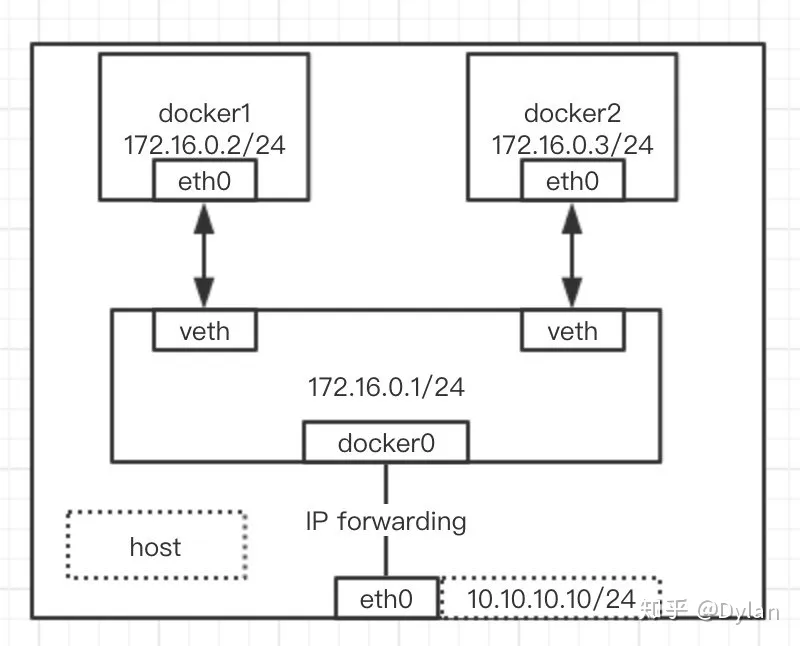
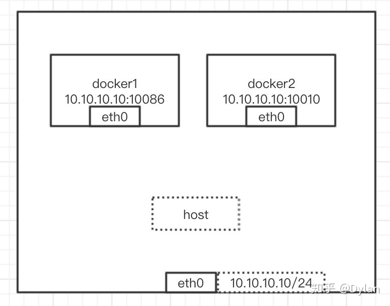
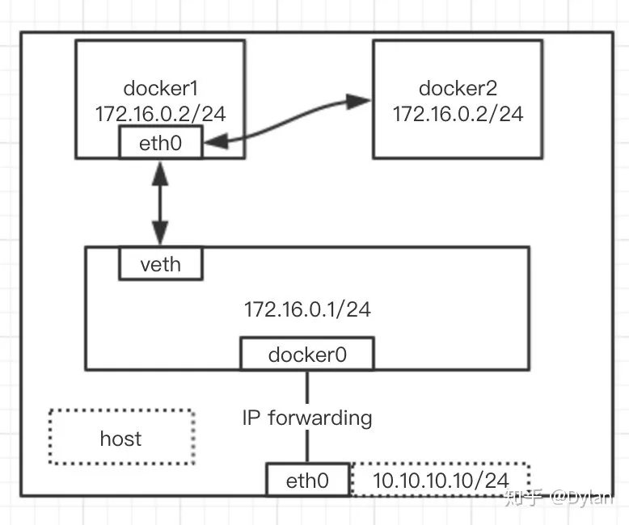
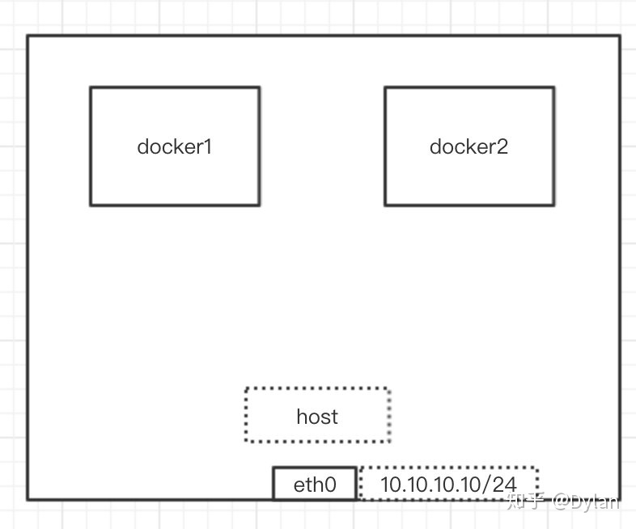

## Docker网路基础理论

|      Docker网络模式      |           配置            |                             说明                             |
| :----------------------: | :-----------------------: | :----------------------------------------------------------: |
|         host模式         |         –net=host         | 容器和宿主机共享Network namespace。 容器将不会虚拟出自己的网卡，配置自己的IP 等，而是使用宿主机的IP和端口。 |
|      container模式       | –net=container:NAME_or_ID | 容器和另外一个容器共享Network namespace.kubernetes中的pod就是多个容器共享一个Network namespace。创建的容器不会创建自己的网卡，配置自己的 IP， 而是和一个指定的容器共享IP、端口范围。 |
|         none模式         |         –net=none         | 容器有独立的Network namespace，并没有对其进行任何网络设置，如分配veth pair和网桥连接，配置IP等。该模式关闭了容器的网络功能。 |
|        bridge模式        |        –net=bridge        | (默认模式)。此模式会为每一个容器分配、设置IP等，并将容器连接到一个docker0虚拟网桥，通过docker0网桥以及Iptable nat表配置与宿主机通信 |
| Macvlan  |            无             |         容器具备Mac地址，使其显示为网络上的物理 设备         |
|         Overlay          |            无             |            (覆盖网络): 利用VXLAN实现的bridge模式             |

### Bridge模式(`连接到Docker0网桥，Docker0再和宿主及通信，Docker0作为容器 网络的网关`)

- docker使用Linux桥接网卡，在宿主机虚拟一个docker容器网桥（docker0），docker启动一个容器时会根据docker网桥的网段分配给容器一个IP地址，称为Container-IP，同时Docker网桥是每个容器的默认网络网关。因为在同一宿主机内的容器都接入同一个网桥，这样容器之间就能够通过容器的Container-IP直接通信。

- docker网桥是宿主机虚拟出来的，并不是真实存在的网络设备，外部网络是无法寻址到的，这也意味着外部网络无法通过直接Container-IP访问到容器。

- 如果容器希望外部访问能够访问到，可以通过映射容器端口到宿主主机(端口映射)，即docker run创建容器时候通过-p或-P参数来启用，访问容器的时候就通过宿主机IP:容器端口访问容器。

### Host 模式(`和宿主机共用IP`)

- 如果启动容器的时候使用host模式，那么这个容器将不会获得一个独立的Network Namespace，而是和宿主机共用一个Network Namespace。容器将不会虚拟出自己的网卡，配置自己的IP等，而是使用宿主机的IP和端口。但是，容器的其他方面，如文件系统、进程列表等还是和宿主机隔离的

### Container模式(`多个容器共用一个IP`)

- 这个模式指定新创建的容器和已经存在的一个容器共享一个 Network Namespace，而不是和宿主机共享。新创建的容器不会创建自己的网卡，配置自己的 IP，而是和一个指定的容器共享 IP、端口范围等。同样，两个容器除了网络方面，其他的如文件系统、进程列表等还是隔离的。两个容器的进程可以通过 lo 网卡设备通信。

  

### None 模式

- 使用none模式，Docker容器拥有自己的Network Namespace，但是，并不为Docker容器进行任何网络配置。Docker容器没有网卡、IP、路由等信息。需要我们自己为Docker容器添加网卡、配置IP等。
- 这种网络模式下容器只有lo回环网络，没有其他网卡。none模式可以在容器创建时通过`--network=none`来指定。**这种类型的网络没有办法联网，封闭的网络能很好的保证容器的安全性。**

-----------------------------------
### Macvlan

https://www.cnblogs.com/bakari/p/10893589.html

### overlay

https://dockertips.readthedocs.io/en/latest/docker-swarm/overlay-network.html
