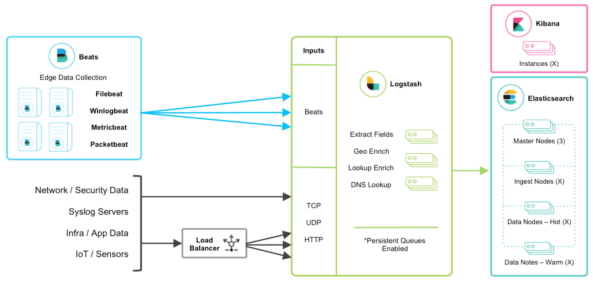
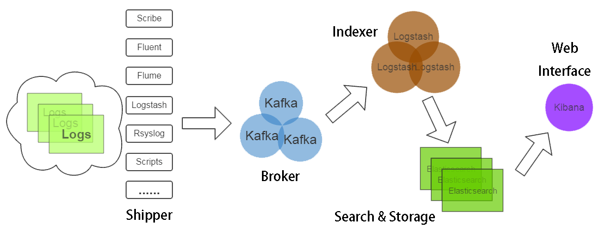
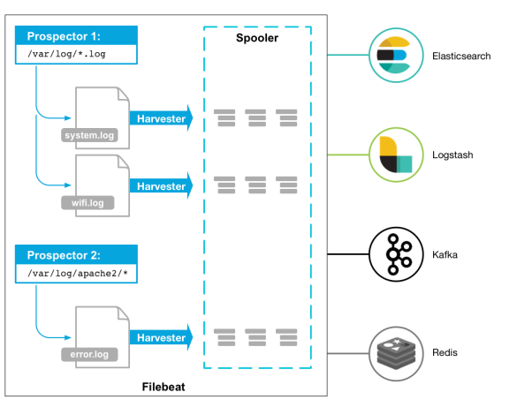
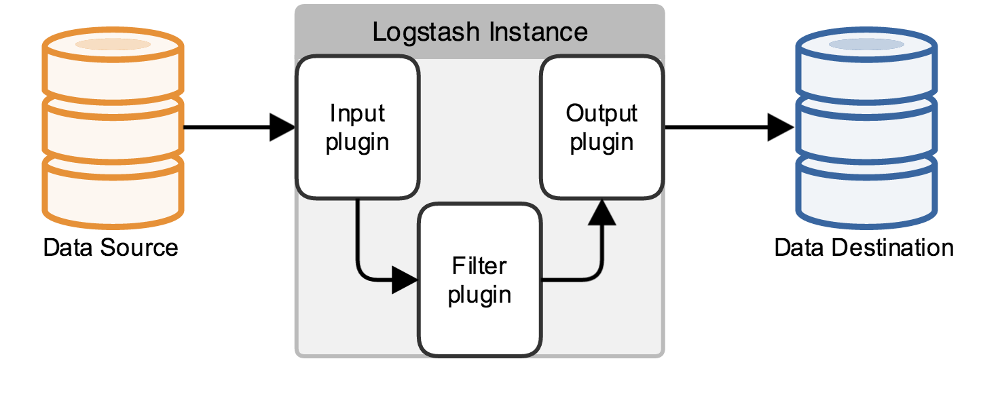

ElasticStack 最初的核心是 ELK (Elasticsearch, Logstash, Kibana) ，后又新增了一个FileBeat。

### ELK架构

- Elasticsearch ：分布式搜索引擎。基于 Lucene，可用于全文检索、结构化检索和分析。
- Logstash ：数据收集处理引擎。支持动态搜集数据，处理、存储数据。
- Kibana ：可视化平台。能够搜索、展示存储在 Elasticsearch 中索引数据。
- Filebeat ：轻量级数据收集引擎。隶属于Beats，替代原先的 Logstash-fowarder 。

[](https://cdn.jsdelivr.net/gh/wujun234/images@master/1545712502366.png)

### 日志分析平台流程

1. 把分散在各个机器的日志汇总到一个地方(Shipper, Broker, Indexer)
2. 把这些日志用某种方式保存并索引起来(Search & Storage)
3. 需要的时候直接在汇总的日志中查询(Web Interface)

[](https://cdn.jsdelivr.net/gh/wujun234/images@master/1545712503433.gif)

## 环境搭建

ELK依赖JDK

ELK下载：https://www.elastic.co/downloads/

### 安装 Elasticsearch

1. 官网下载解压。
2. 安装Head插件，可以通过localhost:9200/_plugin/head查看集群状态

```bash
./bin/plugin install mobz/elasticsearch-head
```

1. 编辑配置文件elasticsearch.yml

```yaml
cluster.name=es_cluster
node.name=node0
path.data=/tmp/elasticsearch/data
path.logs=/tmp/elasticsearch/logs
network.host=centos2
network.port=9200
```

1. 运行 bin/elasticsearch （Windows 上运行 bin\elasticsearch.bat）启动
2. 验证运行成功：REST 访问访问 http://localhost:9200/

### 安装 Logstash

1. 官网下载解压。
2. 添加logstash.conf，指定Input和Output及插件，以log4j输入和ElasticSearch输出为例：

```nginx
input { 
  log4j {
    mode => "server"
    host => "localhost"
    port => 4567
  }
}
filter {
  #Only matched data are send to output.
}
output {
    elasticsearch { 
        action => "index"
        hosts => ["localhost:9200"] 
        index  => "applog"
    }
}
```

1. 运行 bin/logstash -f logstash.conf （Windows 上运行bin/logstash.bat -f logstash.conf）

### 安装 Kibana

1. 官网下载解压。
2. 修改 config/kibana.yml 配置文件，设置 elasticsearch.url 指向 Elasticsearch 实例。

```yaml
server.port: 5601
server.host: “localhost”
elasticsearch.url: http://localhost:9200
kibana.index: “.kibana”
```

1. 运行 bin/kibana （Windows 上运行 bin\kibana.bat）启动
2. 在浏览器上访问 [http://localhost:5601](http://localhost:5601/)

### 安装 Filebeat

1. 官网下载解压。

```bash
curl -L -O https://artifacts.elastic.co/downloads/beats/filebeat/filebeat-5.1.1-x86_64.rpm
sudo rpm -vi filebeat-5.1.1-x86_64.rpm
```

1. 配置filebeat.yml input

```yaml
filebeat.prospectors:
- input_type: log
  paths:
    - /apps/logs/*/info.log
```

1. 配置filebeat.yml output

```yaml
output.logstash:
  hosts: ["127.0.0.1:5044"]
```

1. 启动filebeat

```bash
sudo /etc/init.d/filebeat start
```

## 工作原理

### Filebeat工作原理

Filebeat由两个主要组件组成：prospectors 和 harvesters。这两个组件协同工作将文件变动发送到指定的输出中。

[](https://cdn.jsdelivr.net/gh/wujun234/images@master/1545712503649.png)

- **Harvester（收割机）** :负责读取单个文件内容。
  对每个文件，启动一个Harvester，逐行读取文件内容，并发送到指定输出中。
  如果文件在Harvester运行的时候被重命名或者被删除，Filebeat会继续读取此文件,在Harvester关闭之前，磁盘不会被释放。默认情况filebeat会保持文件打开的状态，直到达到close_inactive（如果此选项开启，filebeat会在指定时间内将不再更新的文件句柄关闭，时间从harvester读取最后一行的时间开始计时。若文件句柄被关闭后，文件发生变化，则会启动一个新的harvester。关闭文件句柄的时间不取决于文件的修改时间，若此参数配置不当，则可能发生日志不实时的情况，由scan_frequency参数决定，默认10s。Harvester使用内部时间戳来记录文件最后被收集的时间。例如：设置5m，则在Harvester读取文件的最后一行之后，开始倒计时5分钟，若5分钟内文件无变化，则关闭文件句柄。默认5m）。
- **Prospector（勘测者）**：负责管理Harvester并找到所有读取源。
  Prospector会找到/apps/logs/*目录下的所有info.log文件，并为每个文件启动一个Harvester。Prospector会检查每个文件，看Harvester是否已经启动，是否需要启动，或者文件是否可以忽略。若Harvester关闭，只有在文件大小发生变化的时候Prospector才会执行检查。只能检测本地的文件。

Filebeat如何记录文件状态：

将文件状态记录在文件中（默认在/var/lib/filebeat/registry）。此状态可以记住Harvester收集文件的偏移量。若连接不上输出设备，如ES等，filebeat会记录发送前的最后一行，并再可以连接的时候继续发送。Filebeat在运行的时候，Prospector状态会被记录在内存中。Filebeat重启的时候，利用registry记录的状态来进行重建，用来还原到重启之前的状态。每个Prospector会为每个找到的文件记录一个状态，对于每个文件，Filebeat存储唯一标识符以检测文件是否先前被收集。

Filebeat如何保证事件至少被输出一次：

Filebeat之所以能保证事件至少被传递到配置的输出一次，没有数据丢失，是因为filebeat将每个事件的传递状态保存在文件中。在未得到输出方确认时，filebeat会尝试一直发送，直到得到回应。若filebeat在传输过程中被关闭，则不会再关闭之前确认所有时事件。任何在filebeat关闭之前为确认的时间，都会在filebeat重启之后重新发送。这可确保至少发送一次，但有可能会重复。可通过设置shutdown_timeout 参数来设置关闭之前的等待事件回应的时间（默认禁用）。

### Logstash工作原理

Logstash事件处理有三个阶段：`inputs` → `filters` → `outputs`。是一个接收，处理，转发日志的工具。

[](https://cdn.jsdelivr.net/gh/wujun234/images@master/1545712503755.png)

**Input**：输入数据到logstash。

一些常用的输入为：

- file：从文件系统的文件中读取，类似于tial -f命令
- syslog：在514端口上监听系统日志消息，并根据RFC3164标准进行解析
- redis：从redis service中读取
- beats：从filebeat中读取

**Filters**：数据中间处理，对数据进行操作。

一些常用的过滤器为：

- grok：解析任意文本数据，Grok 是 Logstash 最重要的插件。它的主要作用就是将文本格式的字符串，转换成为具体的结构化的数据，配合正则表达式使用。内置120多个解析语法。
  官方提供的grok表达式：https://github.com/logstash-plugins/logstash-patterns-core/tree/master/patterns
  grok在线调试：https://grokdebug.herokuapp.com/
- mutate：对字段进行转换。例如对字段进行删除、替换、修改、重命名等。
- drop：丢弃一部分events不进行处理。
- clone：拷贝 event，这个过程中也可以添加或移除字段。
- geoip：添加地理信息(为前台kibana图形化展示使用)

**Outputs**：outputs是logstash处理管道的最末端组件。一个event可以在处理过程中经过多重输出，但是一旦所有的outputs都执行结束，这个event也就完成生命周期。

一些常见的outputs为：

- elasticsearch：可以高效的保存数据，并且能够方便和简单的进行查询。
- file：将event数据保存到文件中。
- graphite：将event数据发送到图形化组件中，一个很流行的开源存储图形化展示的组件。

**Codecs**：codecs 是基于数据流的过滤器，它可以作为input，output的一部分配置。Codecs可以帮助你轻松的分割发送过来已经被序列化的数据。

一些常见的codecs：

- json：使用json格式对数据进行编码/解码。
- multiline：将汇多个事件中数据汇总为一个单一的行。比如：java异常信息和堆栈信息。

> 推荐文档

https://www.digitalocean.com/community/tutorials/how-to-install-elasticsearch-logstash-and-kibana-elastic-stack-on-ubuntu-16-04
