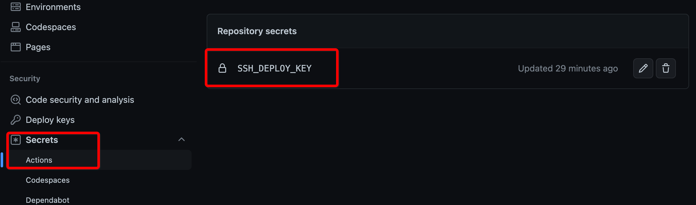
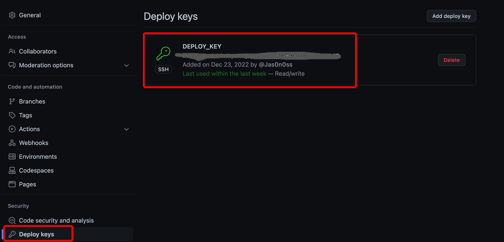

## Setup Authorization for deployment

```bash
>> ssh-keygen  -C "your_email@example.com" -f github-deploy-key
>> ll github-deploy-key*                                                                                                                             13:36.32 五 12 23 2022 >>>
.rw------- 2.6k jason 23 12 12:47 github-deploy-key
.rw-r--r--  573 jason 23 12 12:47 github-deploy-key.pub
```

## Setup authorization in github

Navigate to `Settings` -> `Secrets` -> `Actions` add SSH Private key and name it as `SSH_DEPLOY_KEY`



Navigate to ``Settings` -> `Deploy keys` add SSH public key and mark `Allow write access`



## Create automation workflow file

Create `.github/workflows/main.yml`， copy it  to your `main.yml` and change repository and Git configuration. When it's done, every time you push your new changes to Github，GitHub Actions will automatically deploy your hero website.

```yaml
name: Deployment
on: push

jobs:
  deployment:
    runs-on: ubuntu-latest
    name: Deployment

    steps:
      - name: Check Out
        uses: actions/checkout@v3

      - name: Clone Repo
        uses: actions/checkout@v3
        with:
          repository: Username/Repository    # You have to change to your own Repository Here
          path: .deploy_git

      - name: Setup Node
        uses: actions/setup-node@v3
        with:
          node-version: 16

      - name: Setup Git
        run: |
          git config --global user.name "Example"   # Change it Based on your environment
          git config --global user.email "email@example.com" # Change it Based on your environment

      - name: Setup SSH Key
        run: |
          mkdir -p ~/.ssh
          echo "${{ secrets.SSH_DEPLOY_KEY }}" > ~/.ssh/id_rsa
          chmod 600 ~/.ssh/id_rsa

      - name: Deploy
        run: |
          npm install --location=global hexo-cli
          npm install
          hexo d
```

```bash
```

