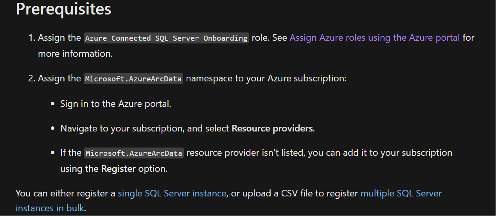
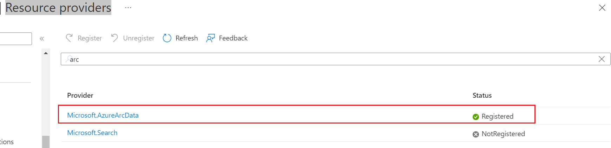

Microsoft official document:

https://learn.microsoft.com/en-us/sql/sql-server/azure-arc/connect?view=sql-server-ver16&tabs=azure%2Cwindows

Before starting, make sure we have fully meet the Prerequisites:



- How to assign Azure Connected SQL Server Onboarding roles in azure portal:

  https://learn.microsoft.com/en-us/azure/role-based-access-control/role-assignments-portal?tabs=current

- How to Assign Microsoft.AzureArcData under your subscription :

  Login azure portal, navigate to `Subscriptions`->`subscription name`->`settings-`> `Resource providers`->search `arc`->make sure the status is `registered`

  

If `Microsoft.AzureArcData` is **not** `registered`, please follow below steps to register resource provider:

https://learn.microsoft.com/en-us/powershell/module/az.resources/register-azresourceprovider?view=azps-8.3.0

```powershell
# Run with powershell with administrator
# install az.resource module
PS C:\WINDOWS\system32> Install-Module -Name Az.Resources -RequiredVersion 2.5.0
 
# connect to your azure account
PS C:\WINDOWS\system32> Connect-AzAccount
 
# register the resource provider
PS C:\Users\hubo> Register-AzResourceProvider -ProviderNamespace Microsoft.AzureArcData
 
# Check register status
PS C:\Users\hubo> Get-AzResourceProvider -ProviderNamespace Microsoft.AzureArcData
```

After above steps, we should be fully prepared to register sql server to azure arc. then we can follow below steps to register to azure arc:

https://learn.microsoft.com/en-us/sql/sql-server/azure-arc/connect?view=sql-server-ver16&tabs=azure%2Cwindows
