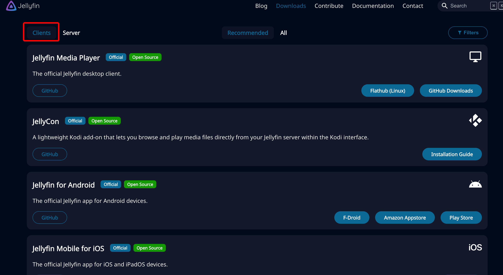
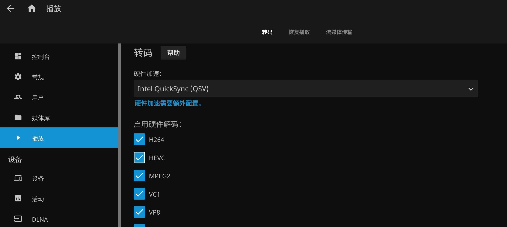
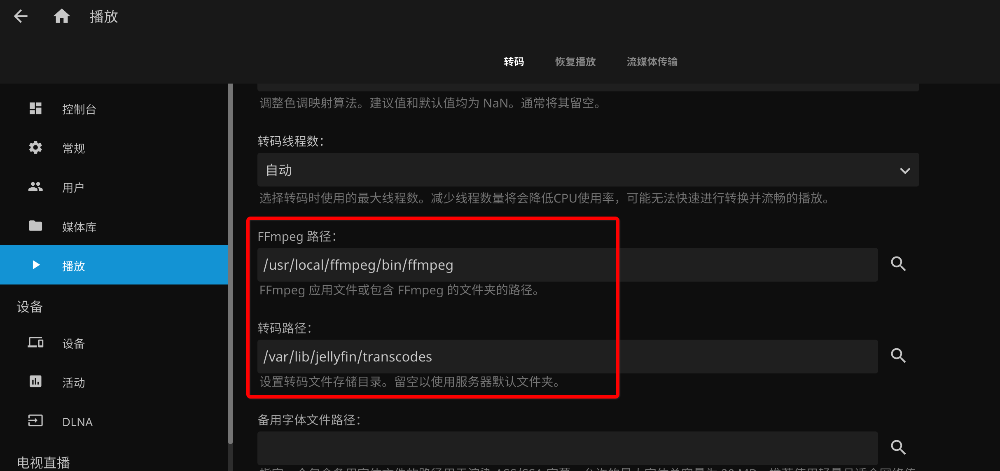
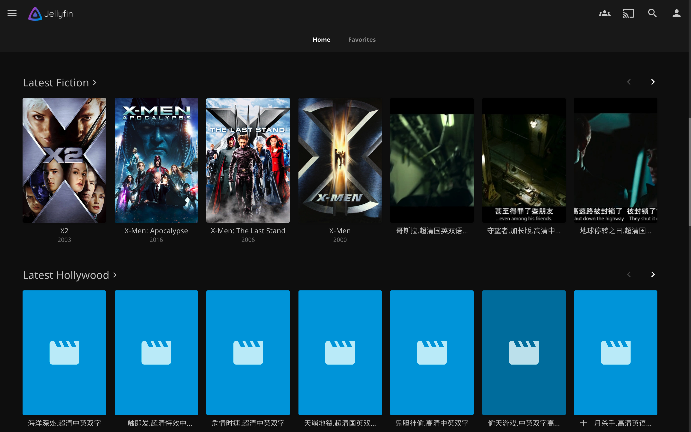

### Jellyfin media center

#### Installation

##### Docker 

https://jellyfin.org/docs/general/installation/container

```bash
[root@LinuxVm jellyfin]# mkdir /data/jellyfin/config -p
[root@LinuxVm jellyfin]# mkdir /data/jellyfin/cache -p
[root@LinuxVm jellyfin]# docker run -itd \
 --name jellyfin \
 --user root \
 --net=host \
 --volume /data/jellyfin/config:/config \
 --volume /data/jellyfin/cache:/cache \
 --mount type=bind,source=/data/share/video,target=/media \
 --mount type=bind,source=/mdata/videos,target=/media1 \
 --mount type=bind,source=/data/aliyun,target=/media2 \
 --restart=unless-stopped jellyfin/jellyfin
[root@LinuxVm jellyfin]# docker ps | grep jellyfin
9534e85c84c2   jellyfin/jellyfin    "/jellyfin/jellyfin"     34 minutes ago   Up 10 minutes (healthy)                                                                                                                                   jellyfin
[root@LinuxVm jellyfin]# docker logs -f jellyfin
```

##### Docker-compose

```yaml
[root@LinuxVm jellyfin]# cat docker-compose.yml
version: "3.5"
services:
  jellyfin:
    image: jellyfin/jellyfin
    container_name: jellyfin
    user: root:root
    network_mode: "host"
    volumes:
      - /data/www/jellyfin/config:/config
      - /data/www/jellyfin/cache:/cache
      - /data/share/video:/media:rw
      - /mdata/videos:/media1:rw
      - /data/aliyun/:/media2:ro
    restart: "unless-stopped"
 [root@LinuxVm jellyfin]# docker-compose up -d
 [root@LinuxVm jellyfin]# docker-compose logs -f
```

##### install on centos

```bash
[root@bo ~]# yum install libicu fontconfig -y
# https://repo.jellyfin.org/releases/server/centos/stable/
# server:
#		The Jellyfin server package. This provides the core Jellyfin server, metapackage, service definitions, and related items.
[root@bo ~]# wget https://repo.jellyfin.org/releases/server/centos/stable/web/jellyfin-web-10.8.8-1.el7.noarch.rpm
# web:
#		The Jellyfin web client package. This provides the WebUI for Jellyfin.
[root@bo ~]# wget https://repo.jellyfin.org/releases/server/centos/stable/server/jellyfin-server-10.8.8-1.el7.x86_64.rpm
[root@bo ~]# rpm -Uvh --nodeps jellyfin-server-10.8.8-1.el7.x86_64.rpm
[root@bo ~]# rpm -Uvh --nodeps jellyfin-web-10.8.8-1.el7.noarch.rpm
# 
[root@bo ~]# vim /usr/lib/systemd/system/jellyfin.service
User = root # change jellyfin to root in case you have access issue of add any media
Group = root # change jellyfin to root in case you have access issue of add any media
[root@bo ~]# systemctl start jellyfin && systemctl enable jellyfin
```

##### Install ffmpeg

- https://ffmpeg.org/download.html
- https://ffmpeg.org/ffmpeg.html

###### Repo install

```bash
sudo yum install epel-release -y
sudo yum localinstall --nogpgcheck https://download1.rpmfusion.org/free/el/rpmfusion-free-release-7.noarch.rpm
sudo yum install ffmpeg ffmpeg-devel -y
ffmpeg -version
```

###### Source code

```bash
# https://ffmpeg.org/download.html#releases
# https://gist.githubusercontent.com/hyer/5a63543966dd2642989a/raw/8fc5b0993b4d0dcbf60cb48e1d0a098b38822669/install-ffmpeg.sh
wget https://ffmpeg.org/releases/ffmpeg-5.1.2.tar.xz
tar -xvf ffmpeg-5.1.2.tar.xz && cd ffmpeg-5.1.2
./configure --prefix=/usr/local/ffmpeg && make && make install
echo "export PATH=/usr/local/ffmpeg/bin:$PATH" >> ~/.bashrc
echo "export LD_LIBRARY_PATH=/usr/local/ffmpeg/lib:$LD_LIBRARY_PATH" >> ~/.bashrc
source ~/.bashrc
ffmpeg -version
```

> **Reset user password**

https://jellyfin.org/docs/general/administration/troubleshooting/#linux-cli

```bash
[root@LinuxVm jellyfin]# sqlite3 /data/www/jellyfin/config/data/jellyfin.db
SQLite version 3.26.0 2018-12-01 12:34:55
Enter ".help" for usage hints.
sqlite> UPDATE Users SET InvalidLoginAttemptCount = 0 WHERE Username = 'root';
sqlite> UPDATE Permissions SET Value = 0 WHERE Kind = 2 AND UserId IN (SELECT Id FROM Users WHERE Username = 'root');
sqlite> .exit
```

##### 挂载阿里云盘的视频到Linux本地，再添到加`jellyfin`媒体中心 

https://github.com/messense/aliyundrive-fuse

```bash
[root@bo ~]# pip install aliyundrive-fuse
[root@bo ~]# mkdir -p /data/aliyun /etc/aliyundrive-fuse
[root@bo ~]# nohup aliyundrive-fuse -r <your-refresh-token> -w /etc/aliyundrive-fuse /data/aliyun &
[root@bo ~]# ls /data/aliyun/video/
Adventures  AmericanTV  ChineseTV  IT  KoreanTV  Movie
```

```bash
# 创建定时脚本确保定时自动挂载
[root@bo ~]# crontab -e
* */1 * * * sh /etc/fuse_check.sh
[root@bo ~]# cat /etc/fuse_check.sh
#!/bin/bash
pidof aliyundrive-fuse >/dev/null
if [ $? -eq 0 ];
	then exit 0
else
	/usr/local/bin/aliyundrive-fuse -r <your-refresh-token> -w /etc/aliyun-fuse/ /data/aliyun | tee /var/log/fuse.log &
fi
```

##### jellyfin Clients

https://jellyfin.org/downloads



Then refresh browser and access http://localhost:8096








