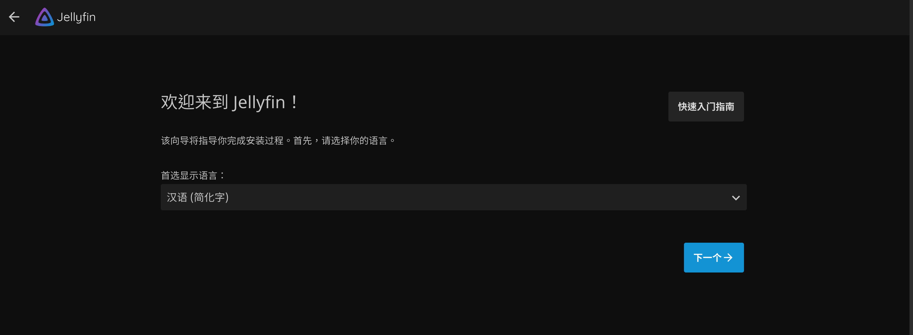
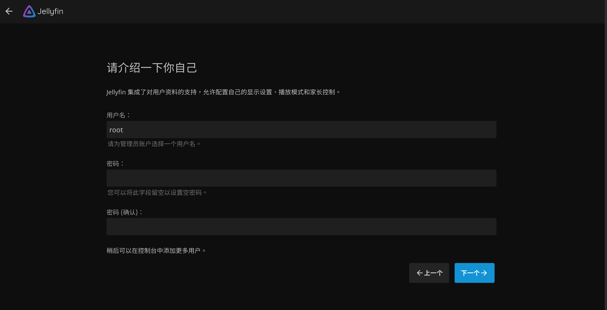

### Jellyfin media center

#### Installation

##### Docker 

https://jellyfin.org/docs/general/installation/container

```bash
[root@LinuxVm jellyfin]# mkdir /data/jellyfin/config -p
[root@LinuxVm jellyfin]# mkdir /data/jellyfin/cache -p
[root@LinuxVm jellyfin]# docker run -itd \
 --name jellyfin \
 --user root \
 --net=host \
 --volume /data/jellyfin/config:/config \
 --volume /data/jellyfin/cache:/cache \
 --mount type=bind,source=/data/share/video,target=/media \
 --mount type=bind,source=/mdata/videos,target=/media1 \
 --mount type=bind,source=/data/aliyun,target=/media2 \
 --restart=unless-stopped jellyfin/jellyfin
[root@LinuxVm jellyfin]# docker ps | grep jellyfin
9534e85c84c2   jellyfin/jellyfin    "/jellyfin/jellyfin"     34 minutes ago   Up 10 minutes (healthy)                                                                                                                                   jellyfin
[root@LinuxVm jellyfin]# docker logs -f jellyfin
```

##### Docker-compose

```yaml
[root@LinuxVm jellyfin]# cat docker-compose.yml
version: "3.5"
services:
  jellyfin:
    image: jellyfin/jellyfin
    container_name: jellyfin
    user: root:root
    network_mode: "host"
    volumes:
      - /data/www/jellyfin/config:/config
      - /data/www/jellyfin/cache:/cache
      - /data/share/video:/media:rw
      - /mdata/videos:/media1:rw
      - /data/aliyun/:/media2:ro
    restart: "unless-stopped"
 [root@LinuxVm jellyfin]# docker-compose up -d
 [root@LinuxVm jellyfin]# docker-compose logs -f
```

Reset user password

https://jellyfin.org/docs/general/administration/troubleshooting/#linux-cli

```bash
[root@LinuxVm jellyfin]# sqlite3 /data/www/jellyfin/config/data/jellyfin.db
SQLite version 3.26.0 2018-12-01 12:34:55
Enter ".help" for usage hints.
sqlite> UPDATE Users SET InvalidLoginAttemptCount = 0 WHERE Username = 'root';
sqlite> UPDATE Permissions SET Value = 0 WHERE Kind = 2 AND UserId IN (SELECT Id FROM Users WHERE Username = 'root');
sqlite> .exit
```

Then refresh browser and access http://host_ip:8096






