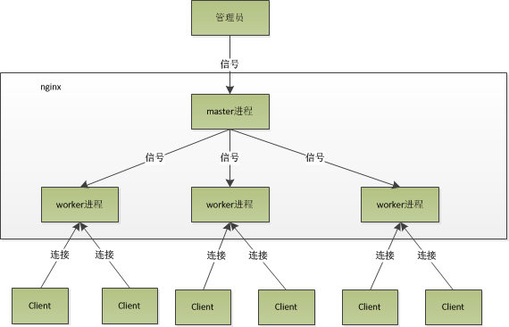

##  nginx architecture

###### 

#### 1. 进程模型

Nginx 分一个master进程和多个worker进程。

- master进程：读取和评估配置，并管理worker进程。接收来外界信号，向worker进程发送信号，监控worker进程运行状态，当worker进程异常退出后，会自动重新启动新的worker进程。
- worker进程：对请求进行实际处理。worker进程之间对等且互相独立，竞争客户端请求，一个请求只能在一个worker进程中处理。worker进程的数量可在配置文件中设置的，一般设置与机器CPU核数一致。

#### 2. 异步非阻塞

master进程根据配置建立好socket，再fork出多个worker进程。worker进程竞争请求，每个worker只有一个主线程，有一个函数，执行无限循环，不断处理收到的来自客户端的请求。异步非阻塞，同时处理的请求只有一个，只是在请求间不断地切换而已。

#### 3. 流畅修改

重启或修改nginx配置，服务不会中断。
　　master进程接到信号，先重新加载配置文件，再启动新worker进程，并向所有老worker进程发送信号。老worker收到信号后，不再接收新的请求，处理完当前进程中请求后退出。

#### 4. 模型优点

- 独立进程，不需要加锁，节省开销。
- 独立进程，互相不影响，一个进程出问题，其它进程还在工作，服务不会中断，降低了风险。

## Nginx install

1. 安装Nginx

https://nginx.org/

```bash
# https://nginx.org/en/download.html
#1、下载 Nginx
wget https://nginx.org/download/nginx-1.22.1.tar.gz
#2、解压安装包
tar zxvf nginx-1.22.1.tar.gz
#3、进入安装包目录
cd nginx-1.22.1
#4、编译安装
./configure --help
./configure --prefix=/usr/local/webserver/nginx --with-http_stub_status_module --with-http_ssl_module
make -j 16 && make -j 16 install
#5、查看nginx版本
/usr/local/webserver/nginx/sbin/nginx -v
```

2. 配置Nginx

- 创建用户 user：

```bash
/usr/sbin/groupadd nginx
/usr/sbin/useradd -g nginx nginx
```

- 配置nginx.conf

```bash
vim /usr/local/webserver/nginx/conf/nginx.conf
```

1. 控制Nginx
   - 启动nginx：运行可执行文件 -s 参数控制Nginx ：
   - stop：快速关闭服务
   - quit：正常关闭服务
   - reload： 重新加载配置文件
   - reopen： 重启 Nginx

## Configuration settings

nginx的配置系统由一个主配置文件nginx.conf和其他一些辅助的配置文件构成。 # 号表示注释。

##### 指令组成 指令由指令名称及其参数组成。

- 简单指令，以分号结尾。如果指令含空格，要用引号括起来。

```
user nobody;
```

- 块指令，包含大括号括起来的复合配置块。

```
server {
  # configuration of HTTP virtual server 2
}
```

##### include指令 为了使配置更易于维护，可将复杂或可服用指令拆分存储在其他.conf，并在主nginx.conf文件中使用include指令引用引进来。

```
include conf.d/http;
```

##### 指令上下文 如果块指令在大括号内部有其他指令，则称为上下文

- main : 任何上下文之外的就属于main，与具体业务功能无关的一些参数。
- http：main中，与提供http服务相关的一些配置参数。如keepalive、gzip。
- server : http中，每个虚拟主机对应一个server配置项，包含该虚拟主机相关的配置。
- location : http中，某些特定的URL对应的一系列配置项。
- mail : 实现email相关的SMTP/IMAP/POP3代理时，共享的一些配置项。
- events : main中，一般连接处理
- stream : TCP协议流量

指令上下文之间可能互相包含。

#### 示例配置

```nginx
user  nobody;
worker_processes  1;
error_log  logs/error.log  info;

events {
    worker_connections  1024;
}

http {
    server {
        listen          80;
        server_name     [www.linuxidc.com](http://www.linuxidc.com/);
        access_log      logs/linuxidc.access.log main;
        location / {
            index index.html;
            root  /var/www/[linuxidc.com/htdocs](http://linuxidc.com/htdocs);
        }
    }

    server {
        listen          80;
        server_name     [www.Androidj.com](http://www.androidj.com/);
        access_log      logs/androidj.access.log main;
        location / {
            index index.html;
            root  /var/www/[androidj.com/htdocs](http://androidj.com/htdocs);
        }
    }
}

mail {
    auth_http  127.0.0.1:80/auth.php;
    pop3_capabilities  "TOP"  "USER";
    imap_capabilities  "IMAP4rev1"  "UIDPLUS";
    server {
        listen     110;
        protocol   pop3;
        proxy      on;
    }

    server {
        listen      25;
        protocol    smtp;
        proxy       on;
        smtp_auth   login plain;
        xclient     off;
    }
}
```

## Nginx modules

nginx是由core和一系列的功能模块所组成。 nginx core实现了底层的通讯协议，为其他模块和nginx进程构建了基本的运行时环境，并且构建了其他各模块的协作基础。

- **event module**: 事件处理模块。提供了各具体事件的处理。
- **phase handler**: handler 模块。主要负责处理客户端请求并产生待响应内容。
- **output filter**: filter 模块。主要是负责对输出的内容进行处理，可以对输出进行修改。
- **upstream**: upstream 模块。实现反向代理的功能，将真正的请求转发到后端服务器上，并从后端服务器上读取响应，发回客户端。upstream模块是一种特殊的handler。
- **load-balancer**: 负载均衡模块。实现特定的算法，在众多的后端服务器中，选择一个服务器出来作为某个请求的转发服务器。

## Nginx main function

1. ### 代理服务器(反向、正向)

2. ### HTTP 服务器(包含动静分离)

3. ### 负载均衡

#### 代理服务器:

##### 反向代理

##### 1. 传递请求

当NGINX代理请求时，它将请求发送到指定的代理服务器，获取响应，并将其发送回客户端。 ***\*_ pass指令**：地址可指定为域名或IP地址(可包括端口)。也可以指向一组命名的服务器。如果URI与地址一起指定，将替换匹配请求的URI。

- proxy_pass 将请求传递给 HTTP 代理服务器
- fastcgi_pass 将请求传递给 FastCGI 服务器
- uwsgi_pass 将请求传递给 uwsgi 服务器
- scgi_pass 将请求传递给 SCGI 服务器
- memcached_pass 将请求传递给 memcached 服务器

```nginx
location /some/path/ {
    proxy_pass http://www.example.com/link/;
}
location ~ \.php {
    proxy_pass http://127.0.0.1:8000;
}
```

##### 2. 传递请求标头

**proxy_set_header**:修改、设置 header 字段，可以在一个或多个 location、server、http 块中指定。

```nginx
location /some/path/ {
    proxy_set_header Host $host;
}
```

##### 3. 配置缓冲区

默认情况下，NGINX 缓存来自代理服务器的响应，直到收到整个响应。 proxy_buffering：启用和禁用缓冲 proxy_buffers ：请求缓冲区的大小和数量 proxy_buffer_size ：响应缓冲区的大小

```nginx
location /some/path/ {
    proxy_buffers 16 4k;
    proxy_buffer_size 2k;
    proxy_pass http://localhost:8000;
}
```

##### 4. 选择传出IP地址

代理服务器配置为只接受特定 IP 的连接时。 proxy_bind：指定 IP

```nginx
location /app1/ {
    proxy_bind 127.0.0.1;
    proxy_pass http://example.com/app1/;
}
```

#### 正向代理

客户端向代理发送一个请求并指定目标，然后代理向原始服务器转交请求并将获得的内容返回给客户端。目前不支持HTTPS。

- resolver：配置正向代理的DNS服务器
- listen：正向代理的端口

```nginx
    resolver 114.114.114.114 8.8.8.8;
    server {
        resolver_timeout 5s;
        listen 81;
        access_log  e:/wwwrootproxy.access.log;
        error_log   e:/wwwrootproxy.error.log;
        location / {
            proxy_pass http://$host$request_uri;
        }
    }
```

#### HTTP服务器

##### Web服务器

##### 1. 日志

- access_log 访问日志，可结合if参数条件记录
- error_log 错误日志

##### 2. server

- server：http中，定义多个虚拟服务器
- listen：指定侦听请求的IP地址和端口。如果省略端口，则使用标准端口。 如果省略地址，将侦听所有地址。
- server_name：如多个server匹配listen，可指定主机头域

##### 3. 资源定位

- root：指定搜索文件的根目录，可放在http，server或location
- index：指令定义索引文件的名称，默认为index.html 匹配root+URI+index
- try_files：检查指定的文件或目录是否存在，如果没有则返回配置的URI、状态代码、代理。

##### 4. 返回特定状态码

- return [响应代码] [重定向URL]|[响应文本]：返回指令

##### 5. 重写URI

- rewrite regex replacement [flag]：location 和 server中，结合正则表达式和标志位实现url重写以及重定向
  - last： 停止执行当前上下文中的重写指令
  - break：停止执行当前虚拟主机的后续rewrite指令集
  - redirect ：返回302临时重定向
  - permanent ：返回301永久重定向

##### 6. 重写HTTP响应

- sub_filter：重写或更改响应中的内容
- error_page : 处理错误

##### 7. 压缩和解压

- gzip：向客户端发送响应之前，NGINX会执行压缩
- gunzip：为了服务于不接受压缩数据的客户端

```nginx
map $status $loggable {
  ~^[23] 0;
  default 1;
}
access_log /access.log combined if=$loggable;
error_log /error.log;

http {
    server {
        listen       80;      
        server_name  localhost;
        client_max_body_size 1024M; 
        gzip on;

        location / {  
            root /data/www;
            index  index.html;
            try_files $uri https://cdn.jsdelivr.net/gh/wujun234/images@master/default.gif;
            try_files $uri $uri/ $uri.html =404;
            try_files $uri $uri/ @backend;
        }

        location /users/ {
            rewrite ^/users/(.*)$ /show?user=$1 break;
        }

        location @backend {
            proxy_pass http://backend.example.com;
        }

        location /wrong/url {
            return 404;
        }

        location / {
            gunzip on;
            sub_filter 'href="http://127.0.0.1:8080/' 'href="https://$host/';
            sub_filter /blog/ /blog-staging/;
            sub_filter_once on;
        }

        error_page 404 /404.html;
    }
}
```

如果访问http://localhost就会默认访问到/data/www目录下面的index.html。

##### 动静分离

根据请求URI拆分动静资源，分开导流向不同的代理或提供不同的文件

#### 负载均衡

根据规则随机的将请求分发到指定的服务器上处理，负载均衡配置一般都需要同时配置反向代理，通过反向代理跳转到负载均衡。

Nginx 目前支持自带 3 种负载均衡策略，还有 2 种常用的第三方策略。

##### 1. RR(默认)

每个请求按时间顺序逐一分配到不同的后端服务器，如果后端服务器down掉，能自动剔除。

```nginx
upstream test {
    server localhost:8080;
    server localhost:8081;
}

server {
    location / {
        proxy_pass http://test;
        proxy_set_header Host $host:$server_port;
    }
}
```

##### 2. 权重

指定轮询几率，weight 和访问比率成正比，用于后端服务器性能不均的情况。

```nginx
upstream test {
    server localhost:8080 weight=9;
    server localhost:8081 weight=1;
}
```

##### 3. ip_hash

ip_hash 的每个请求按访问 ip 的 hash 结果分配，每个访客固定访问一个服务器，可解决程序状态问题。

```nginx
upstream test {
    ip_hash;
    server localhost:8080;
    server localhost:8081;
}
```

##### 4. fair(第三方)

按后端服务器的响应时间来分配请求，响应时间短的优先分配。

```nginx
upstream backend {
    fair;
    server localhost:8080;
    server localhost:8081;
}
```

##### 5. url_hash(第三方)

按访问url的hash结果来分配请求，使每个url定向到同一个后端服务器，后端服务器为缓存时比较有效。 在upstream中加入hash语句，server语句中不能写入weight等其他的参数，hash_method是使用的hash算法

```nginx
upstream backend {
    hash $request_uri;
    hash_method crc32;
    server localhost:8080;
    server localhost:8081;
}
```
