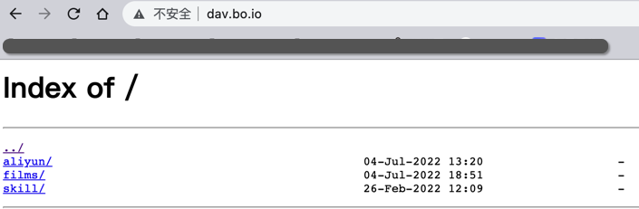

##### 源码编译Nginx Dav模块
https://www.cnblogs.com/aboa/p/16453738.html

```bash
yum install -y gcc make libpcre3-dev libssl-dev zlib1g-dev libxml2-dev libxslt-dev libgd-dev libgeoip-dev git
#
wget https://nginx.org/download/nginx-1.22.0.tar.gz && tar zxvf nginx-1.22.0.tar.gz && cd nginx-1.22.0
#
git clone https://github.com/arut/nginx-dav-ext-module.git
#
./configure --prefix=/usr/local/nginx --conf-path=/etc/nginx/nginx.conf --http-log-path=/var/log/nginx/access.log --error-log-path=/var/log/nginx/error.log --lock-path=/var/lock/nginx.lock --pid-path=/run/nginx.pid --modules-path=/usr/lib/nginx/modules --http-client-body-temp-path=/var/lib/nginx/body --http-fastcgi-temp-path=/var/lib/nginx/fastcgi --http-proxy-temp-path=/var/lib/nginx/proxy --http-scgi-temp-path=/var/lib/nginx/scgi --http-uwsgi-temp-path=/var/lib/nginx/uwsgi --with-debug --with-compat --with-pcre-jit --with-http_ssl_module --with-http_stub_status_module --with-http_realip_module --with-http_auth_request_module --with-http_v2_module --with-http_dav_module --with-http_slice_module --with-threads --with-http_addition_module --with-http_geoip_module=dynamic --with-http_gunzip_module --with-http_gzip_static_module --with-http_image_filter_module=dynamic --with-http_sub_module --with-http_xslt_module=dynamic --with-stream=dynamic --with-stream_ssl_module --with-mail=dynamic --with-mail_ssl_module --add-module=./nginx-dav-ext-module
#
make -j32 && make install
```

##### 配置Nginx

```bash
mkdir include /etc/nginx/conf/ -p && mkdir /var/lib/nginx/
cat >/etc/nginx/nginx.conf<<EOF
user root;
worker_processes auto;
pid /run/nginx.pid;
events {
        worker_connections 768;
        # multi_accept on;
}
http {
        sendfile on;
        tcp_nopush on;
        tcp_nodelay on;
        keepalive_timeout 65;
        types_hash_max_size 2048;
        # server_tokens off;
        # server_names_hash_bucket_size 64;
        # server_name_in_redirect off;
        include /etc/nginx/mime.types;
        default_type application/octet-stream;
        ssl_prefer_server_ciphers on;
        access_log /var/log/nginx/access.log;
        error_log /var/log/nginx/error.log;
        gzip on;
        gzip_disable \"msie6\";
        include /etc/nginx/conf/*;
}
EOF

#
cat >/etc/nginx/conf/dav.conf<<EOF
server {
							server_name dav.bo.io;
              listen 80;
              location / {
                              set \$dest \$http_destination;
                              if (-d \$request_filename) {
                                              rewrite ^(.*[^/])\$ \$1/;
                                              set \$dest \$dest/;
                              }
                              if (\$request_method ~ MKCOL) {
                                              rewrite ^(.*[^/])\$ \$1/ break;
                              }
                              root /data/aliyun/;
                              autoindex on;
                              dav_methods PUT DELETE MKCOL COPY MOVE;
                              dav_ext_methods PROPFIND OPTIONS;
                              create_full_put_path on;
                              client_max_body_size 0M;
                              dav_access user:rw group:rw all:rw;
                              auth_basic \"Authorized Users Only\";
                              auth_basic_user_file /etc/nginx/webdavpasswd;
              }
}
EOF
#
echo admin:$(openssl passwd -crypt Passw0rd1)>/etc/nginx/webdavpasswd
```

##### Nginx service

```bash
cat >/usr/lib/systemd/system/nginx.service<<EOF
[Unit]
Description=A high performance web server and a reverse proxy server
After=network.target

[Service]
Type=forking
PIDFile=/run/nginx.pid
ExecStartPre=/usr/local/nginx/sbin/nginx -t -q -g 'daemon on; master_process on;'
ExecStart=/usr/local/nginx/sbin/nginx -g 'daemon on; master_process on;'
ExecReload=/usr/local/nginx/sbin/nginx -g 'daemon on; master_process on;' -s reload
ExecStop=-/sbin/start-stop-daemon --quiet --stop --retry QUIT/5 --pidfile /run/nginx.pid
TimeoutStopSec=5
KillMode=mixed

[Install]
WantedBy=multi-user.target">/usr/lib/systemd/system/nginx.service
EOF
systemctl enable nginx && systemctl start nginx
```

##### 挂载aliyun drive

https://github.com/messense/aliyundrive-fuse

```bash
#
mkdir -p /data/aliyun && yum install fuse3.x86_64 -y
pip3 install aliyundrive-fuse
nohup aliyundrive-fuse -r <refresh-token> -w /var/run/aliyundrive-fuse /data/aliyun &
tail nohup.out
```



