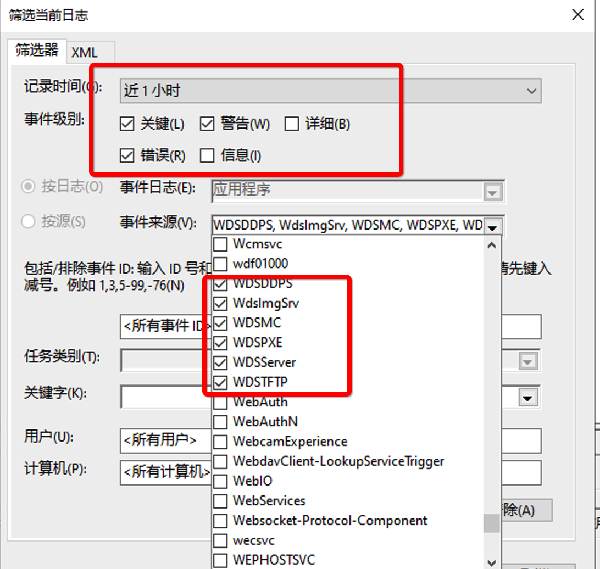
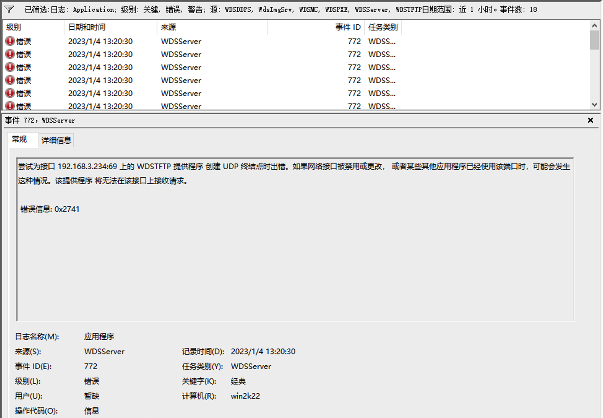
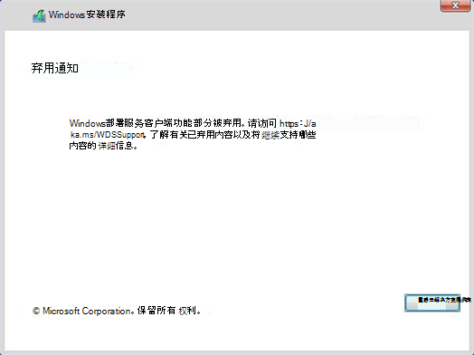

#### **Issue description:**

When I use windows employment service to install windows server, encountered such error msg:

When I checked WDS logs find client can't get IP address caused this , So I double checked and the configuration on WDS:

Configurations like below, `Definitely, this is wrong`!!!. I use DHCP service on my router to provide IP address to clients, So I change to get IP from `DHCP `like below, then restart the client problem solved.

Checking on system up application logs:

> Reference

https://social.technet.microsoft.com/Forums/windows/en-US/8feca2eb-c8c7-4ced-8932-e34d7ffaa83e/wds-event-772-not-pxe-booting-with-server-2016-and-gen-2-hyperv-vm-or-physical-pc#:~:text=Event%20772%20WDSServer%3A%20An%20error%20occurred%20while%20trying,be%20able%20to%20receive%20requests%20on%20this%20interface.

---

https://learn.microsoft.com/zh-cn/windows/deployment/wds-boot-support

I also meet errors, I followed MS official documentation issue solved.

