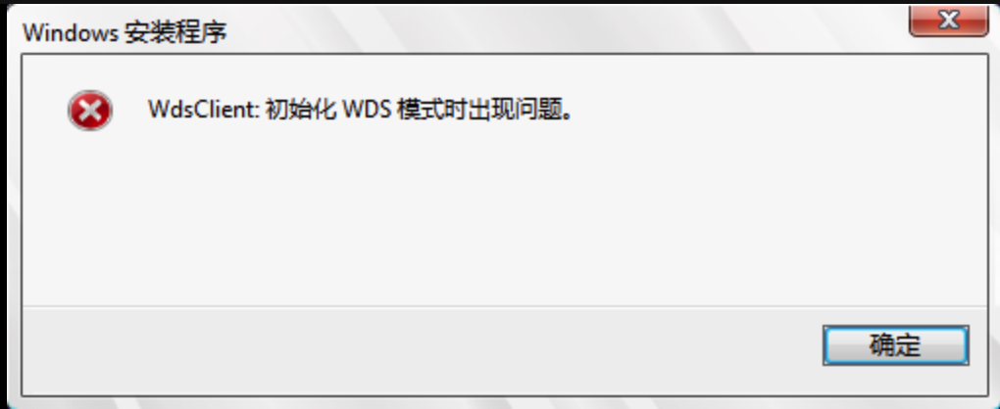
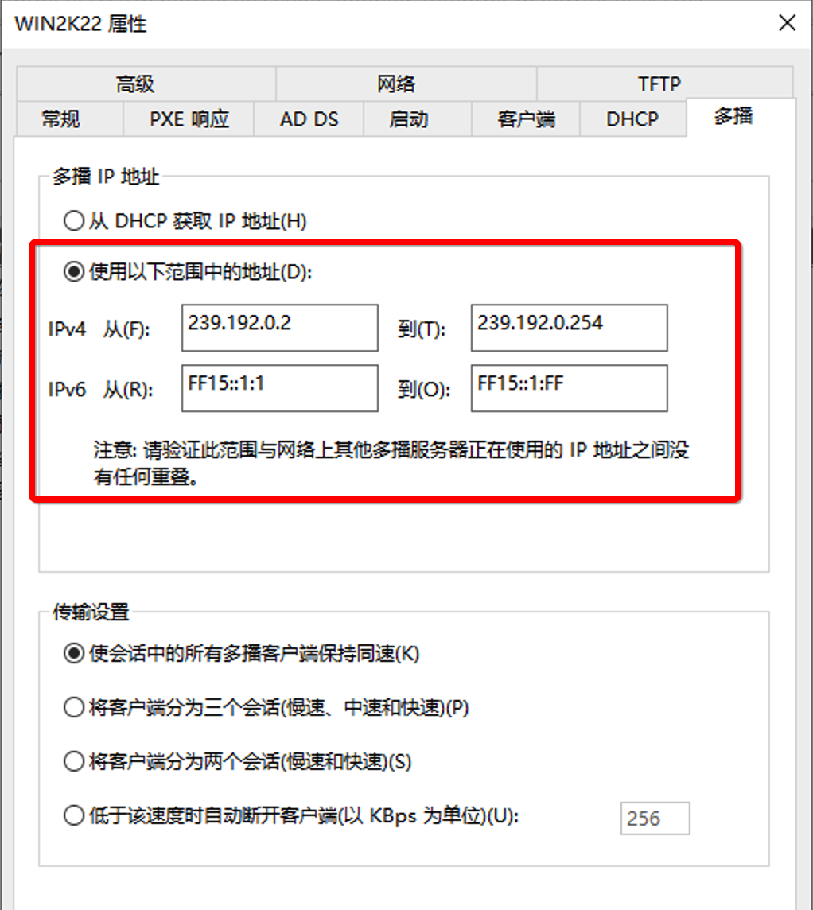
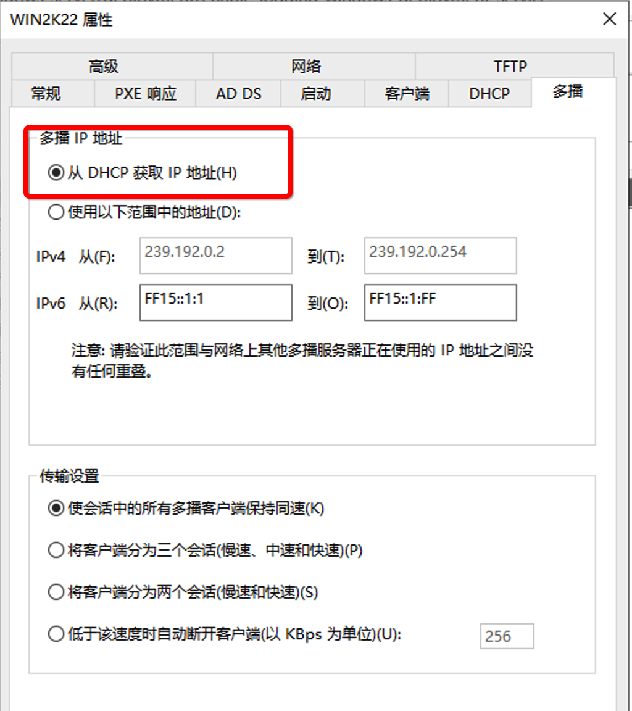
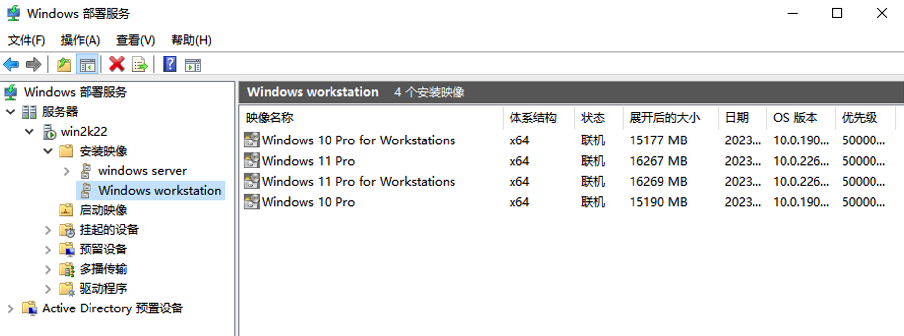

#### **Issue description:**

When I use windows employment service to install windows server, encountered such error msg:

When I checked WDS logs find client can't get IP address caused this , So I double checked and the configuration on WDS:

`Definitely, this is wrong`!!!. I use DHCP service on my router to provide IP address to clients, So I change to get IP from `DHCP `like below, then restart the client problem solved.

