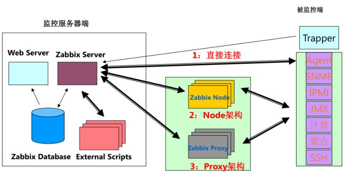
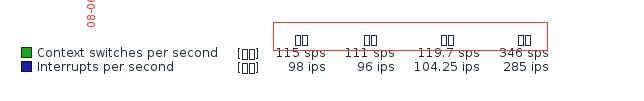

Zabbix 手册：https://www.zabbix.com/documentation/3.4/zh/manual

Zabbix 3.0 从入门到精通(zabbix使用详解)：https://www.cnblogs.com/clsn/p/7885990.html

### 一、概述

Zabbix能监控各种网络参数，以及服务器健康性和完整性。提供了灵活的通知机制，以快速反馈服务器的问题。提供了Web的前端页面，以访问报告、统计信息和配置参数。

#### 1、组成结构

zabbix由Zabbix server、Zabbix proxy和Zabbix agent组成

##### Zabbix server

核心程序，通过主动轮询和被动捕获数据，计算是否满足触发器条件，向用户发送通知。
分三个不同组件：Zabbix服务器、Web前端和数据库存储。

##### Zabbix proxy

可选部署，替Zabbix Server收集数据，分担负载压力。
所有收集的数据都在本地进行缓存，然后传送到proxy所属的Zabbix sever。需要使用独立的数据库。

##### Zabbix agent

部署在监控目标，调用本地系统监控性能，收集数据，报告给Zabbix Server。
可以执行被动和主动两种检查方式。

#### 2、工作原理

zabbix agent需要安装到被监控的主机上，它负责定期收集各项数据，并发送到zabbix server端，zabbix server将数据存储到数据库中，zabbix web 根据数据在前端进行展现和绘图。

agent收集数据分为两种模式：

##### 被动模式

server/proxy向agent请求获取监控项的数据，agent应答数据请求，回送结果。
默认采用，客户端量大之后，pull任务会出现积压，出现延迟和卡顿。
被动模式端口不可用时，也可选用主动模式

##### 主动模式

agent先请求server获取主动的监控项列表，再主动将收集数据周期性提交给server/proxy。
更改为主动模式后，监控项也要选择主动模式。

#### 3、常用架构

在实际监控架构中，zabbix根据网络环境、监控规模等分了三种架构：

##### server-client架构

最简单的架构，监控机和被监控机之间不经过任何代理，直接由zabbix server和zabbix agentd之间进行数据交互。 适用于网络比较简单，设备比较少的监控环境。

##### server-proxy-client架构

proxy沟通server、client，分担负载压力，没有前端，缓存agentd数据，再提交给server。 适用于跨机房、跨网络的中型网络架构的监控。

##### master-node-client架构

每个node同时也是一个server端，node下面可以接proxy，也可以直接接client 。node有自已的配置文件和数据库，其要做的是将配置信息和监控数据向master同步，master的故障或损坏对node其下架构的完整性。 适用于跨网络、跨机房、设备较多的大型环境。

[](https://cdn.jsdelivr.net/gh/wujun234/images@master/1545712504937.jpg)

### 二、安装

#### Zabbix server

##### 依赖

依赖Apache、MySQL、PHP，需事先装好LAMP环境。

##### 从部署包安装

以CentOS 7 、zabbix3.2为例

1. 安装源码库配置部署包。

```bash
rpm -ivh http://repo.zabbix.com/zabbix/3.2/rhel/7/x86_64/zabbix-release-3.2-1.el7.noarch.rpm
```

1. 安装Zabbix部署包。

```bash
yum install zabbix-server-mysql zabbix-web-mysql
```

1. 安装初始化数据库

```sql
shell> mysql -uroot -p<password>
mysql> create database zabbix character set utf8 collate utf8_bin;
mysql> grant all privileges on zabbix.* to zabbix@localhost identified by '<password>';
mysql> quit;
```

1. 导入初始架构和数据。

```bash
cd /usr/share/doc/zabbix-server-mysql-3.2.11
zcat create.sql.gz | mysql -uroot zabbix
```

1. 修改Zabbix前端的Apache配置文件

更改时区

```bash
vi /etc/httpd/conf.d/zabbix.conf
php_value date.timezone Asia/Shanghai
```

1. 启动Zabbix Server进程

```bash
systemctl start zabbix-server
```

1. 重启Apache Web服务器

```bash
systemctl start httpd
```

1. 访问/setup.php初始化

访问http://zabbix-frontend-hostname/zabbix/setup.php，配置数据库等信息。

默认的用户名／密码为 `Admin/zabbix`。

##### 配置通知脚本

1. 将通知脚本放入默认路径：`/usr/lib/zabbix/alertscripts`。
2. 在“报警媒介类型”添加通知脚本。

#### Zabbix Agent

```bash
yum install zabbix-agent
```

##### 被动模式配置

1、agent端

```bash
StartAgents=3//被动模式，启动客户端数不为0
Server=x.x.x.x//允许获取数据的地址，可配置0.0.0.0/0允许任意ip获取数据
Hostname=zabbix_client//与服务端设置的名字相同
```

2、zabbix-server端
zabbix监控模板默认使用的就是被动模式，直接添加就好

##### 主动模式配置

1、agent端

```bash
StartAgents=0//主动模式，不启动客户端
ServerActive=x.x.x.x//配置服务器地址，可配置域名，域名如用nginx需要tcp转发10051端口
Hostname=zabbix_master//与服务端设置的名字相同
```

2、zabbix-server端
克隆默认的模板，将配置项和自动发现改为主动模式，主机连接主动模式模板

### 三、迁移

在新服务器上安装好相同版本Zabbix server。

##### 不保留历史数据

只需迁移配置文件。

> Zabbix server配置文件：/etc/zabbix/zabbix_server.conf
> Zabbix web配置文件：/etc/httpd/conf.d/zabbix.conf
> 通知脚本：/usr/lib/zabbix/alertscripts

##### 保留历史数据

还需迁移数据库。

1.导出zabbix数据库

```bash
mysqldump -uroot -p --opt  zabbix > zabbix.sql
```

2.传送sql文件到新的服务器上（新服务器上基本环境应搭建好）

```bash
scp zabbix.sql root@x.x.x.x:/tmp
```

3.在新服务器上导入sql文件

```bash
mysql -uroot -p zabbix < zabbix.sql
```

### 四、使用

为了创建一个监控项(item)用于采集数据，必须先创建一个主机（host）。告警方面，在监控项里创建触发器（trigger），通过触发器（trigger）来触发告警动作（action）。

或者对主机使用模板。

##### 添加用户

1. 以具有“超级管理员”权限的用户登陆。
2. 在“管理”→“用户”页面下，点击“创建用户”以增加用户。
3. 填写基本信息，选择用户组，
4. 在“报警媒介”标签下，添加邮箱和微信报警
5. 在“权限”标签下，选择用户类型

##### 添加主机

1. 以具有“超级管理员”权限的用户登陆。
2. 在“配置”→“主机”页面下，点击“创建主机”以新增主机。
3. 主机名称和IP地址都填写IP地址，选择主机组。

##### 添加监控项

1. 在“主机”→“监控项”页面下，点击“创建监控项”以新增监控项。
2. 类型根据客户端选择“Zabbix客户端”或“Zabbix客户端（主动式）”
3. 键值填写 Zabbix Agent[预定义值](https://www.zabbix.com/documentation/3.4/manual/config/items/itemtypes/zabbix_agent) 中的一种。
4. “历史数据保留时长”填写7天。

##### 添加触发器

1. 在“主机”→“触发器”页面下，点击“创建触发器”以新增触发器。
2. 填写名称、选择表达式

##### 添加报警媒介

1. 在“管理”→“报警媒介类型”页面下，点击“创建报警媒介”以新增报警媒介。
2. 添加类型为脚本，名称为/usr/lib/zabbix/alertscripts下通知脚本的报警媒介
3. 在“配置”→“动作”页面下，点击“创建动作”以新增报警媒介的动作。

##### 添加模版

1. 在“配置”→“模版”页面下，点击“创建模版”以新增模版。
2. 为模板添加监控项，之后就可给主机链接模板，复用监控项

### 五 、 配置问题

Zabbix中文界面下，图形页面会有乱码，是因为字体格式不一致导致

[](https://cdn.jsdelivr.net/gh/wujun234/images@master/1545712505256.jpg)

1. 从C:\Windows\Fonts找到 中文字体上传至zabbix的fonts目录/usr/share/zabbix/fonts
2. 修改include下的defines.inc.php中字体的配置，将里面关于字体设置从graphfont替换成simkai，使用`%s/graphfont/simhei/g`命令对graphfont进行全局替换
3. 刷新页面

### 六、zabbix主动模式、被动模式

zabbix agent检测分为主动（agent active）和被动（agent）两种形式，主动与被动的说法均是相对于agent来讨论的。

- 主动：agent请求server获取主动的监控项列表，并主动将监控项内需要检测的数据提交给server/proxy
- 被动：server向agent请求获取监控项的数据，agent返回数据。

默认采用被动模式，但当被监控端数量过多时，被动模式会出现严重的性能问题：

1. Web操作很卡，容易出现502
2. 图层断裂
3. 开启的进程（Pollar）太多，即使减少item数量，以后加入一定量的机器也会有问题

优化主要有两个方向：

1. 添加Proxy节点或者Node模式做分布式监控
2. 调整Agentd为主动模式

### 被动模式

客户端默认端口10050

#### 流程

Server打开一个TCP连接
Server发送一个key为agent.ping
Agent接受这个请求，然后响应< HEADER >< DATALEN >
Server对接受到的数据进行处理
TCP连接关闭

#### 配置

1、agent端重点

```bash
StartAgents=3//被动模式，启动客户端数不为0
Server=x.x.x.x//允许获取数据的地址，可配置0.0.0.0/0允许任意ip获取数据
Hostname=zabbix_client//与服务端设置的名字相同
```

2、zabbix-server端
zabbix监控模板默认使用的就是被动模式，直接添加就好

### 主动模式

#### 流程

1.获取列表

Agent向Server建立一个TCP连接
Agent请求需要检测的items数据列表
Server响应Agent，发送一个Items列表
Agent处理响应
TCP连接完成本次会话关闭
Agent开始周期性地收集数据

2.主动检测提交数据

Agent建立TCP连接 Agent提交items列表收集的数据 Server处理数据，并返回响应状态 关闭TCP连接

#### 配置

1、agent配置

```bash
StartAgents=0//主动模式，不启动客户端
ServerActive=x.x.x.x//配置服务器地址，可配置域名，域名如用nginx需要tcp转发10051端口
Hostname=zabbix_master//与服务端设置的名字相同
```

2、zabbix-server端 克隆默认的模板，将配置项和自动发现改为主动模式，主机连接主动模式模板

### 七、Zabbix迁移

zabbix的前端所有的操作都存在zabbix数据库里。
如果迁移要求历史数据不丢失，对zabbix库中相应的表进行导出导入即可。
若是对历史数据不要求，那么只迁移配置信息即可。

### 安装

- 根据zabbix手册新安装zabbix服务端，如果需要保留历史数据，务必使用相同版本。
- 安装好后访问/setup.php初始化。
- 同步数据库。
- 若想升级，先按相同版本迁移，再执行升级流程，否则版本不同数据库差异很大，错误连连。
- 配置邮件发送，使用smtp，不要自己配置sendmail等，坑多。

### 数据库

1.导出zabbix数据库

```bash
mysqldump -uroot -p --opt  zabbix > zabbix.sql
```

2.传送sql文件到新的服务器上（新服务器上基本环境应搭建好）

```bash
scp zabbix.sql root@x.x.x.x:/tmp
```

3.在新服务器上导入sql文件

```bash
mysql -uroot -p zabbix < zabbix.sql
```

\#zabbix库可以是一个新建的库，也可以是已经存在的库，因为sql文件再导入时，会先看表是否存在，假如表存在会先删除再导入
